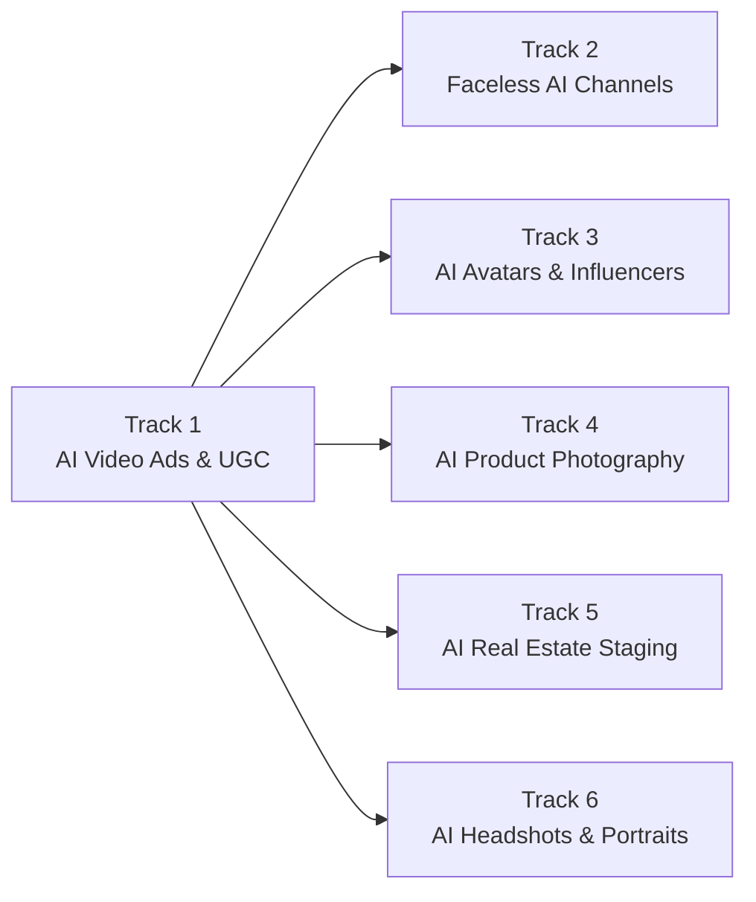

# AI Creator Academy

> Free, open-source curriculum for making money with generative AI image, video, and audio — for creators and agencies, not developers.

Most AI education either teaches you to prompt a tool, or teaches you to build one. This teaches neither — it teaches you to turn AI-generated image/video/audio into an actual, priced, sellable service or product. Every module ends with pricing, positioning, and where to find your first client — not just "how it works."

Six tracks, ranked by real-world demand evidence, not by what's easiest to teach:



See [ROADMAP.md](ROADMAP.md) for full status — Track 1 is live, the rest are coming soon.

## The shape of a module

Every module in every track follows the same structure, so you always know what you're getting:

```
Problem → Concept → Do It → Compare Tools → Launch It → Exercises
```

- **Problem / Concept** — the real pain this solves, and the mental model behind it, before any steps.
- **Do It** — the actual step-by-step workflow.
- **Compare Tools** — the honest tradeoff between API-based generation, other paid tools, and local/self-hosted models — never just "APIs are easier."
- **Launch It** — pricing, positioning, and where to find your first client. This is the part most tutorials skip, and the reason this curriculum exists.

See [LESSON_TEMPLATE.md](LESSON_TEMPLATE.md) for the full template used to write every module.

## Getting started

**Read online.** Browse a track under [`tracks/`](tracks/) — start with [Track 1](tracks/01-ai-video-ads-ugc/).

**Clone and go:**

```bash
git clone https://github.com/Anil-matcha/ai-creator-academy.git
cd ai-creator-academy
open tracks/01-ai-video-ads-ugc/01-how-ugc-works/module.md
```

### Prerequisites

- No coding required.
- An API key for a generative media provider (any provider works — [muapi.ai](https://muapi.ai) is used as the reference throughout, since it aggregates 250+ models under one API).
- Curiosity about running this as an actual service, not just a hobby.

## Why free and open source

Every module publishes real pricing ranges and demand evidence with sources where possible, instead of vague income claims — the goal is a curriculum you can verify, not just trust. Contributions that add new tracks or improve existing modules are welcome; see [CONTRIBUTING.md](CONTRIBUTING.md).

## License

MIT — see [LICENSE](LICENSE).
